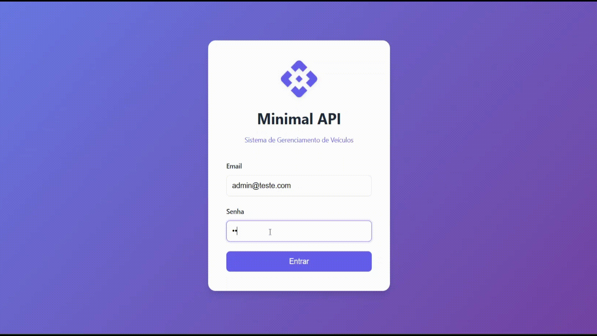

# Minimal API - Sistema de Gerenciamento de Veículos

API REST desenvolvida em .NET 6.0 para gerenciamento de veículos com autenticação JWT e controle de acesso baseado em perfis.

## 🎥 Demonstração

Confira o GIF demonstrando brevemente a aplicação:



## 📋 Pré-requisitos

Antes de executar a aplicação, certifique-se de ter instalado:

- [.NET 6.0 SDK](https://dotnet.microsoft.com/download/dotnet/6.0) ou superior
- [MySQL Server](https://dev.mysql.com/downloads/mysql/) (versão 8.0 ou superior)
- Um editor de código (Visual Studio, VS Code, Rider, etc.)

## 🚀 Como Executar Localmente (Método Simples)

### ⚡ Setup Rápido (Opcional)

Para facilitar ainda mais, você pode usar os scripts de setup:

**Windows:**

```bash
setup.bat
```

**Linux/Mac:**

```bash
chmod +x setup.sh
./setup.sh
```

Os scripts irão:

- ✅ Restaurar as dependências do .NET
- ✅ Mostrar os próximos passos

---

### Opção 1: Usando Script SQL (⭐ Recomendado - Mais Rápido)

Este método é o mais simples e já inclui dados de exemplo para testar.

#### 1. Clone o Repositório

```bash
git clone https://github.com/seu-usuario/MINIMAL-API.git
cd MINIMAL-API
```

#### 2. Configure o Banco de Dados

**Passo 1:** Edite o arquivo `Api/appsettings.json`, configurando sua conexão MySQL (apenas a senha):

```json
{
  "ConnectionStrings": {
    "MySql": "Server=localhost;Database=minimal_api;Uid=root;Pwd=SUA_SENHA;"
  }
}
```

**💡 Dica:**

- O arquivo `appsettings.json` já vem configurado com `Uid=root`
- Você só precisa alterar a senha (`Pwd=`) na string de conexão
- **Sem senha:** `Pwd=;` (deixe vazio)
- **Com senha:** `Pwd=minhasenha123;` (coloque sua senha entre as aspas)

**Passo 2:** Execute o script SQL para criar o banco com dados de exemplo:

```bash
# No MySQL (via linha de comando ou MySQL Workbench)
mysql -u root -p < database.sql

# Ou importe o arquivo database.sql pelo MySQL Workbench
```

O script `database.sql` na raiz do projeto irá:

- ✅ Criar o banco de dados `minimal_api`
- ✅ Criar todas as tabelas necessárias
- ✅ Inserir 2 usuários de teste (admin e editor)
- ✅ Inserir 5 veículos de exemplo para testar

#### 3. Execute a Aplicação

```bash
cd Api
dotnet restore
dotnet run
```

Pronto! Acesse `http://localhost:5134` no navegador.

---

### Opção 2: Usando Migrations (Método Alternativo)

Se preferir usar as migrations do Entity Framework:

#### 1. Clone e Configure

```bash
git clone https://github.com/seu-usuario/MINIMAL-API.git
cd MINIMAL-API
```

#### 2. Configure o Banco de Dados

Crie o banco de dados no MySQL:

```sql
CREATE DATABASE minimal_api;
```

Configure `Api/appsettings.json` com sua string de conexão.

#### 3. Execute as Migrations

```bash
cd Api
dotnet restore

# Instale o Entity Framework Tools (se ainda não tiver)
dotnet tool install --global dotnet-ef

# Execute as migrations
dotnet ef database update
```

Isso criará as tabelas e inserirá os usuários padrão (mas sem veículos de exemplo).

#### 4. Execute a Aplicação

```bash
dotnet run
```

A API estará disponível em:

- **HTTP:** `http://localhost:5134`

### 6. Acesse a Interface Web ou Swagger

**Opção 1: Interface Web (Recomendado para testes fáceis)**

Abra seu navegador e acesse:

- `http://localhost:5134`

A interface web permite:

- ✅ Fazer login facilmente
- ✅ Visualizar todos os veículos em cards
- ✅ Adicionar novos veículos
- ✅ Editar veículos existentes
- ✅ Excluir veículos
- ✅ Interface moderna e responsiva

**Opção 2: Documentação Swagger (Para desenvolvedores)**

Abra seu navegador e acesse:

- `http://localhost:5134/swagger`

## 🔐 Credenciais Padrão

Após executar o script SQL ou as migrations, você terá dois usuários para testar:

### 👤 Administrador (Acesso Total):

- **Email:** `admin@teste.com`
- **Senha:** `admin`
- **Perfil:** `Adm`
- **Pode:** Ver, criar, editar e excluir veículos e administradores

### 👤 Editor (Acesso Limitado):

- **Email:** `editor@teste.com`
- **Senha:** `editor`
- **Perfil:** `Editor`
- **Pode:** Ver, criar e editar veículos
- **Não pode:** Excluir veículos ou acessar área de administradores

**💡 Dica:** Se você usou o script `database.sql`, já terá 2 veículos de exemplo para testar!

## 📚 Endpoints Principais

### Autenticação

- `POST /administradores/login` - Realiza login e retorna token JWT

### Administradores (Requer perfil "Adm")

- `GET /administradores` - Lista todos os administradores
- `GET /administradores/{id}` - Busca administrador por ID
- `POST /administradores` - Cria novo administrador

### Veículos (Requer perfil "Adm" ou "Editor")

- `GET /veiculos` - Lista todos os veículos
- `GET /veiculos/{id}` - Busca veículo por ID
- `POST /veiculos` - Cria novo veículo
- `PUT /veiculos/{id}` - Atualiza veículo (apenas "Adm")
- `DELETE /veiculos/{id}` - Remove veículo (apenas "Adm")

## 🛠️ Tecnologias Utilizadas

### Backend

- **.NET 6.0** - Framework principal
- **Entity Framework Core 6.0** - ORM para acesso ao banco de dados
- **Pomelo.EntityFrameworkCore.MySql** - Provider MySQL para EF Core
- **JWT Bearer Authentication** - Autenticação baseada em tokens
- **Swagger/OpenAPI** - Documentação da API
- **MySQL** - Banco de dados

### Frontend

- **HTML5** - Estrutura
- **CSS3** - Estilização moderna e responsiva
- **JavaScript (Vanilla)** - Lógica e consumo da API

````
## 🐛 Solução de Problemas

### Erro de conexão com o banco de dados

- Verifique se o MySQL está rodando
- Confirme se a string de conexão está correta no `appsettings.json`
- Verifique se o banco de dados `minimal_api` foi criado

### Erro ao executar migrations

- Certifique-se de ter o Entity Framework Tools instalado:
  ```bash
  dotnet tool install --global dotnet-ef
````

### Porta já em uso

- Altere a porta no arquivo `Properties/launchSettings.json` ou
- Pare o processo que está usando a porta

## 📝 Notas Importantes

- Esta é uma aplicação de **teste/estudo**, não recomendada para uso em produção sem as devidas melhorias de segurança
- As senhas não estão sendo hasheadas (apenas para fins educacionais)
- O token JWT expira em 1 dia
- A chave JWT está configurada no `appsettings.json` - em produção, use variáveis de ambiente

## 📄 Licença

Este projeto é apenas para fins educacionais.
